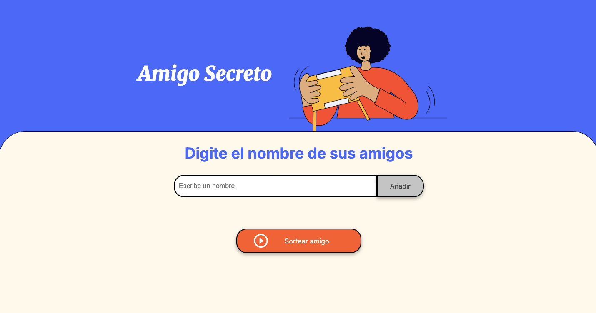
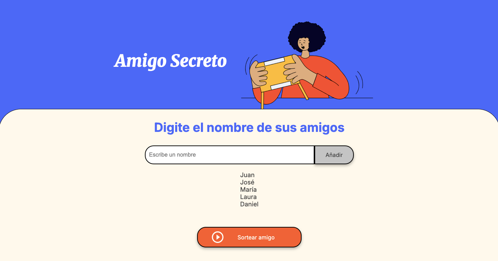
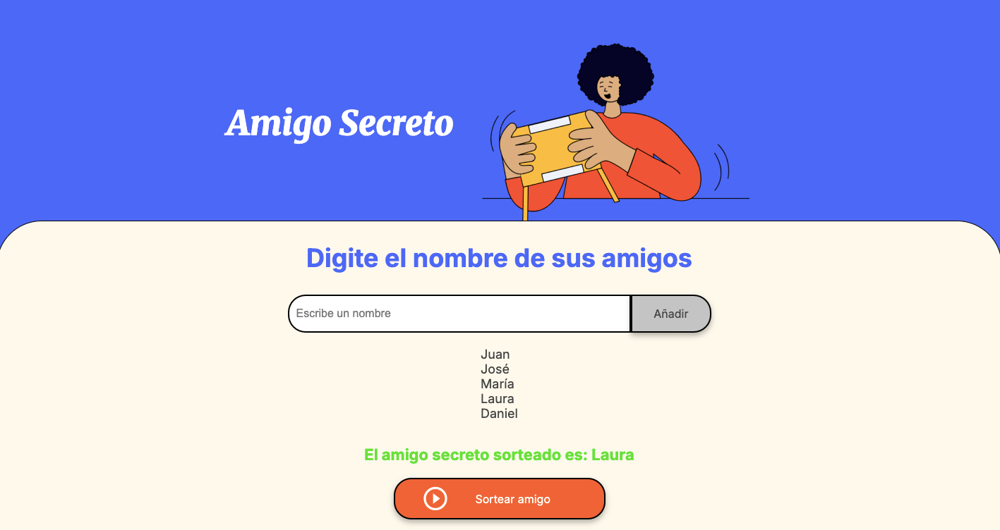

# 🎁 Amigo Secreto

Este proyecto es una sencilla aplicación web para gestionar un sorteo de **Amigo Secreto**.
Permite ingresar nombres, mostrarlos en una lista y sortear aleatoriamente uno de los participantes.

## 🚀 Funcionalidades

- ➕ **Agregar nombres**: Podés ingresar nombres uno por uno para participar del sorteo.
- 📜 **Visualizar lista**: Los nombres se muestran en una lista a medida que se ingresan.
- ❌ **Evitar duplicados**: Si ingresás el mismo nombre dos veces, la app lo detecta y muestra una alerta.
- 🎲 **Sortear al azar**: Al hacer clic en el botón “Sortear amigo”, se elige un nombre al azar de los ya ingresados.
- 🎨 **Diseño responsive**: Con un estilo moderno y adaptado a diferentes dispositivos.

## 📸 Capturas de Pantalla

### 1. Pantalla Inicial


### 2. Nombres Ingresados


### 3. Resultado del Sorteo


## 📹 Video demostrativo


## ⚙️ Cómo usar

### Ingresando mediane la URL

- 🔗: [Amigo Secreto](https://github.com/yamilrafart2)

### Clonando el repositorio

1. **Cloná el repositorio** (o descargalo):
   ```bash
   git clone https://github.com/yamilrafart2/amigo-secreto-challenge
   ```

2. **Abrí el archivo** `index.html` en tu navegador:
   - No se necesita servidor.
   - Todo funciona en el navegador.

## 📁 Estructura del proyecto

```
amigo-secreto/
│
├── index.html       # Página principal
├── style.css        # Estilos visuales
├── app.js           # Lógica en JavaScript
├── assets/
│   ├── amigo-secreto.png
│   ├── demo01.gif
│   ├── play_circle_outline.png
│   ├── screenshot01.png
│   ├── screenshot02.png
│   └── screenshot03.png
└── README.md        # Documentación del proyecto
```

## 🛠 Tecnologías utilizadas

- HTML5
- CSS3
- JavaScript

## ✅ Próximas mejoras

- 🔄 Función para reiniciar la lista.
- 🗑 Función para eliminar un nombre la lista.

## 👨‍💻 Autor

- Nombre: Yamil Arturo Rafart
- GitHub: [@yamilrafart2](https://github.com/yamilrafart2)
